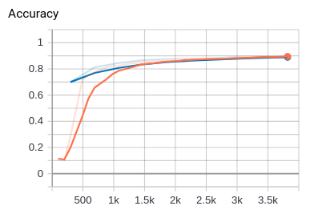
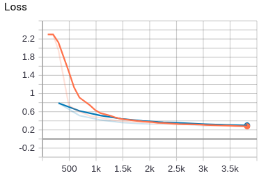

# PyTorch-AlexNet

This is a very basic implementation of the AlexNet convolutional neural network in PyTorch. The original research paper is available here: https://papers.nips.cc/paper/4824-imagenet-classification-with-deep-convolutional-neural-networks.pdf.
The repository contains pretrained net.pth file that can be loaded and used to test the network.

## Network structure

AlexNet consists of five convolutional layers and three fully connected layers. The dropouts are right before the first two fully connected layers.Batch size was set to 128, starting learning rate to 0.005 and weight decay to 0.0005.

## Regularization techniques

To prevent overfitting and improve the model accuracy following regularization methods were implemented for the model:

1. Batch normalization
2. Random horizontal flip
3. Dropout
4. Changing learning rate

## Dataset

The dataset used to test the network is Fashion MNIST. Because the images are greyscale instead of RGB the network structure had to be altered slightly.

## Results

The network was tested with Fashion MNIST dataset for 10 epoches. The following snippet is contains the results of the final epoch and the resulting testing data. The model does not show symptoms of overfitting because the model has not reduced it's learning rate and the training, validation and testing accuracies are all pretty close to each other. Because of this the accuracy could be improved by more training to get better accuracy.
```
[Epoch/iter]: [9/100], loss: 0.27852, accuracy: 0.89273
[Epoch/iter]: [9/200], loss: 0.27724, accuracy: 0.89656
[Epoch/iter]: [9/300], loss: 0.26921, accuracy: 0.89789
Elapsed time: 255.21 seconds, end of epoch: 9, lr: 0.005, val_loss: 0.28084, val_acc: 0.89600
Accuracy on testing data: 0.89140
```

**Figure 1** Training and validation accuracies during the training process


**Figure 2** Training and validation losses during the training process



